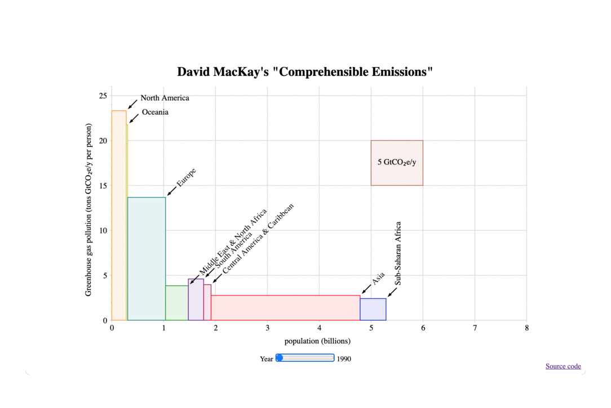

# comprehensible-emissions

This is an interactive version of this plot:
 from page 12 of David MacKay's ["Sustainable Energy: Without the Hot Air"](https://withouthotair.com/).

[Demo](https://naughty-payne-5d77a3.netlify.app)

Emissions data from climatewatchdata.org

Population data from population.un.org

Regional mapping is saved in `data/raw/region.csv`, based on MacKay's original plot, informed by the [UN geoscheme](https://en.wikipedia.org/wiki/United_Nations_geoscheme).